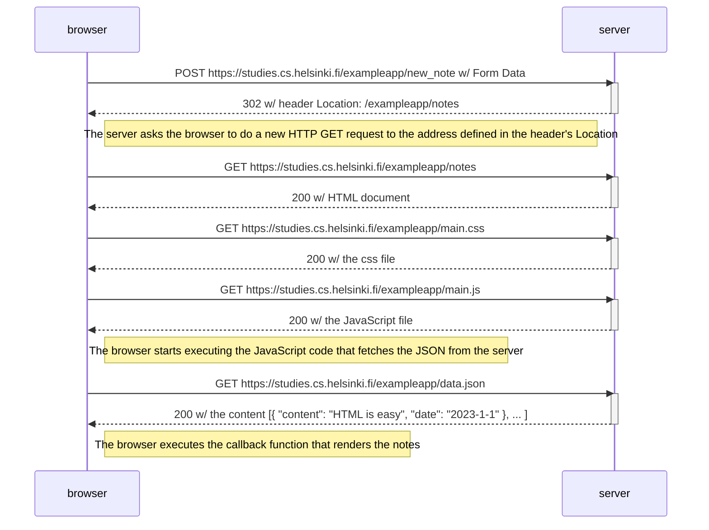

# New note diagram

```mermaid
sequenceDiagram
participant browser
participant server

      browser->>server: POST https://studies.cs.helsinki.fi/exampleapp/new_note w/ Form Data
      activate server
      server-->>browser: 302 w/ header Location: /exampleapp/notes
      deactivate server
      Note left of server: The server asks the browser to do a new HTTP GET request to the address defined in the header's Location

      browser->>server: GET https://studies.cs.helsinki.fi/exampleapp/notes
      activate server
      server-->>browser: 200 w/ HTML document
      deactivate server

      browser->>server: GET https://studies.cs.helsinki.fi/exampleapp/main.css
      activate server
      server-->>browser: 200 w/ the css file
      deactivate server

      browser->>server: GET https://studies.cs.helsinki.fi/exampleapp/main.js
      activate server
      server-->>browser: 200 w/ the JavaScript file
      deactivate server

      Note right of browser: The browser starts executing the JavaScript code that fetches the JSON from the server

      browser->>server: GET https://studies.cs.helsinki.fi/exampleapp/data.json
      activate server
      server-->>browser: 200 w/ the content [{ "content": "HTML is easy", "date": "2023-1-1" }, ... ]
      deactivate server

      Note right of browser: The browser executes the callback function that renders the notes
```
